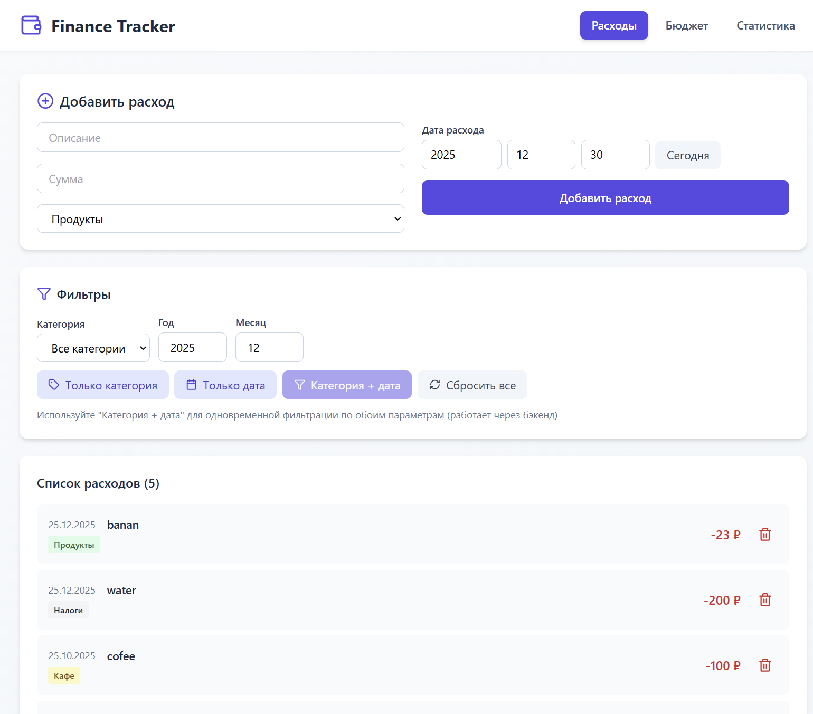
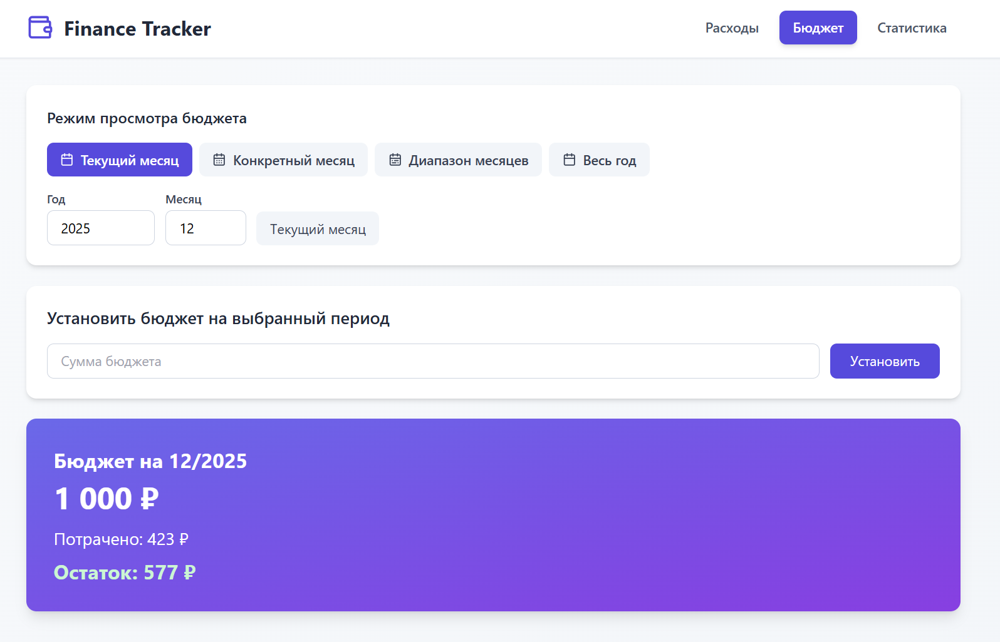
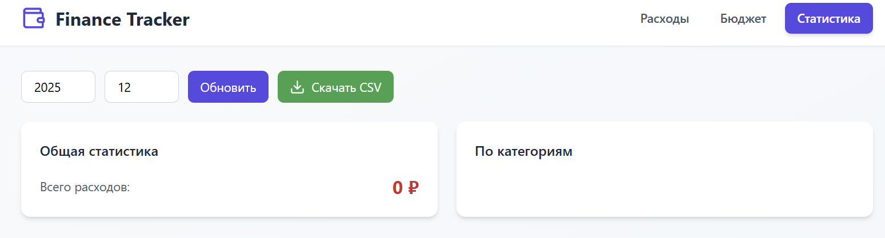

# 💰 Expense Tracker


**Expense Tracker** — простое и удобное веб-приложение для учёта личных финансов.

Приложение позволяет:
- добавлять, редактировать и удалять расходы;
- устанавливать месячный бюджет;
- фильтровать расходы по категориям и месяцам;
- просматривать статистику;
- экспортировать данные в CSV.

Проект полностью написан на **Python** с использованием **FastAPI**.  
Фронтенд реализован в виде **статических файлов** (React через CDN + Tailwind CSS + Lucide Icons) и отдаётся напрямую бэкендом.

---

## 🖼️ Скриншоты





---

## ✨ Возможности

- Полный **CRUD** для расходов  
- Комбинированная фильтрация по **категориям и месяцам**  
- Установка месячного бюджета:
  - расчёт остатка;
  - предупреждение о превышении  
- Статистика расходов по категориям за выбранный месяц  
- Экспорт расходов в **CSV** (генерация на лету)  
- Адаптивный и минималистичный интерфейс  
- Покрытие тестами (**pytest**)  
- Запуск в **Docker** одной командой  

---

## 🛠️ Технологии

**Backend**
- FastAPI
- SQLModel
- SQLite

**Frontend**
- React (CDN)
- Tailwind CSS
- Lucide Icons

**Инфраструктура**
- Docker / Docker Compose
- pytest
- StreamingResponse (CSV)
- CORS

---

## 📁 Структура проекта

```
Expense_Tracker/
│
├── .venv/                    # Виртуальное окружение (не коммитится)
├── budget/                   # Логика работы с месячным бюджетом
├── crud/                     # CRUD-операции для расхода
├── database/                 # Подключение к БД и инициализация таблиц
├── frontend/                 # Статические файлы фронтенда (HTML, CSS, JS)
├── func/                     # Бизнес-логика (фильтры, статистика, CSV)
├── models/                   # Модели данных (SQLModel)
├── routers/                  # API роутеры FastAPI
├── screenshots/              # Скриншоты приложения для README
├── tests/                    # Автотесты (pytest)
│
├── database.db               # SQLite база данных
├── main.py                   # Точка входа в приложение
├── Dockerfile                # Docker-образ приложения
├── docker-compose.yml        # Docker Compose конфигурация
├── requirements.txt          # Python-зависимости
├── README.md                 # Документация проекта
└── .dockerignore             # Исключения для Docker
```
## 🚀 Запуск проекта

### 💻 Локальный запуск (для разработки)

1. **Клонируйте резиторий:**
```bash
git clone https://github.com/ваш-username/Expense_Tracker.git
cd Expense_Tracker
```
2. Убедитесь, что установлен Python 3.12+:
```bash
python --version
```
3. Создайте и активируйте виртуальное окружение:
 ```bash
# Создание виртуального окружения
python -m venv .venv

# Активация (выберите команду для вашей ОС)
# Linux/Mac:
source .venv/bin/activate
# Windows:
# .venv\Scripts\activate
```
4. Установите зависимости:
```bash
pip install -r requirements.txt
```
5. Запустите приложение:
```bash
python main.py
```
6. Откройте в браузере: http://localhost:8000

### 🐳 Запуск в Docker (рекомендуется)
Предварительные требования:
- Установленный Docker
- Установленный Docker Compose
Шаги запуска:
1. Соберите и запустите контейнеры:
```bash
docker compose up --build
```
2. Приложение будет доступно по адресу: http://localhost:8000
3. Для остановки
```bash
docker compose down
```
## 📚 API Документация
После запуска приложения доступна автоматически сгенерированная документация:
### Swagger UI (интерактивная)
Перейдите по адресу: http://localhost:8000/docs
- Тестирование API endpoints прямо из браузера
- Подробное описание всех параметров запросов
- Возможность отправки тестовых запросов
### 📖 ReDoc (альтернативная)
Перейдите по адресу: http://localhost:8000/redoc
- Более читабельный формат документации
- Подробные схемы данных
- Удобная навигация
## 🧪 Тестирование
Запуск тестов
```bash
# Все тесты
pytest

# С подробным выводом
pytest -v

# С покрытием кода
pytest --cov=.

# Конкретный тестовый файл
pytest tests/test_expenses.py
```
### 📊 Что покрыто тестами:
- CRUD операции
- Бюджет (работа с месячными лимитами и расчетами)
- Фильтры (по датам, категориям, суммам)
- Экспорт CSV
### Структура тестов:
```
tests/
├── test_expenses.py      # Тесты CRUD операций
├── test_budget.py        # Тесты работы с бюджетом
├── test_filters.py       # Тесты фильтрации
```
